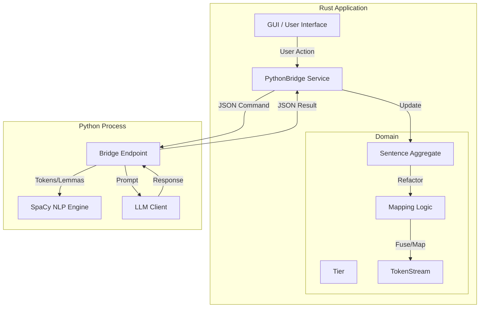
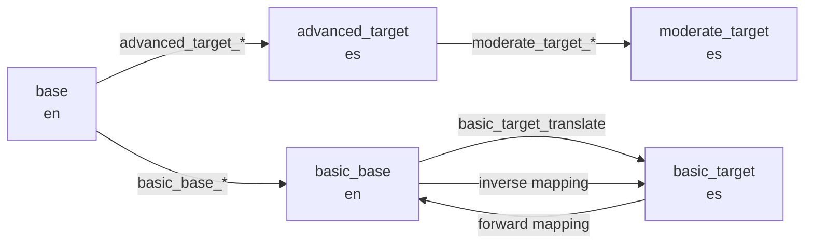
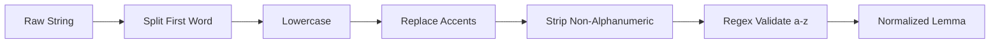

# Data Flow Diagrams

## 1. Rust vs. Python System Overview

This diagram illustrates the separation of concerns between the new Rust-based Domain logic and the existing Python services (NLP, LLM).



## 2. Mapping & Fusion Workflow (`apply_llm_mapping`)

This details the internal logic of `src/domain/mapping_logic.rs`, which replaces the Python `refactor_token_stream` and `align_and_parse_to_atoms`.

```mermaid
graph TD
    Start[Input: Raw LLM Text + TokenStream] --> Parse[Parse LLM Response]
    Parse -->|ParsedMapping[]| ExtractGroups[Extract Source Groups]
    
    subgraph Fusion Process
        ExtractGroups --> Iterate[Iterate Groups]
        Iterate --> Norm[Normalize Group Text]
        Norm --> Lookahead{Fuzzy Match?}
        Lookahead -- Yes (Levenshtein) --> Fuse[Fuse Tokens]
        Lookahead -- No --> Error[Return Error]
        Fuse --> UpdateStream[Update TokenStream]
    end
    
    UpdateStream --> Validate{Count Match?}
    Validate -- No --> Error
    Validate -- Yes --> CreateMap[Create TierMapping]
    
    CreateMap -->|Iterate| CheckNoSub{Is NO_SUB?}
    CheckNoSub -- Yes --> MarkInv[Mark is_viable=False]
    CheckNoSub -- No --> AddEntry[Add MappingEntry]
    
    AddEntry --> Finish[Return TierMapping]
```

## 3. Tier Relationships (V11 Architecture)

This reflects the standardized tier naming convention (removing legacy `simple_target`).

```mermaid
graph LR
    subgraph Source Language (English)
        Base[basic_base]
    end
    
    subgraph Target Language (Spanish)
        Target[basic_target]
    end
    
    Base -->|Forward Mapping| Target
    Target -->|Inverse Mapping| Base
    
    note1[Forward: English IDs -> Spanish Text]
    note2[Inverse: Spanish IDs -> English Text]
    
    Base -.-> note1
    Target -.-> note2
```

## 4. V8.1 Tier Dependency Graph — English-Source

The full four-tier ladder used when `project_languages = (en, es)` (i.e. `source_is_target = false`). Stage dispatch is centralized in `services::tier_graph::stage_dispatch`.



## 5. V8.1 Tier Dependency Graph — Spanish-Source (Author-Driven Lessons)

When `project_languages = (es, es)` (`source_is_target = true`), the basic branch reverses direction and the advanced step degenerates to a verbatim echo for segmentation only. This is the canonical configuration for `teaching_mode = on` lesson files.

```mermaid
graph LR
    base[base<br/>es]
    adv[advanced_target<br/>es<br/>(echo, segmentation only)]
    mod[moderate_target<br/>es<br/>(skipped in simple_mode)]
    btgt[basic_target<br/>es]
    bbas[basic_base<br/>en]

    base -->|advanced_segment_es| adv
    adv -. simple_mode skips .-> mod
    base -->|basic_target_simplify_es| btgt
    btgt -->|basic_base_translate<br/>es → en| bbas

    btgt -->|forward mapping| bbas
    bbas -->|inverse mapping| btgt
```

Notes:

- `advanced_segment_es` is a verbatim-echo prompt; the downstream segmenter handles segment boundaries. The dispatch resolution carries `segmentation_only = true` so a future optimization can skip the LLM round-trip entirely.
- In Spanish-source mode, `basic_base` is hardcoded to learner language `en` (see `tier_graph::lang_for_tier`). A future `learner_lang` field will lift this constraint.

## 6. Simple Mode + Friendly Shielding Flow

```mermaid
flowchart TD
    Import[import source<br/>%%META preamble parsed%%] --> Apply[Apply SourceMeta to AppState]
    Apply --> Mode{simple_mode?}

    Mode -- on --> SkipAdv[Skip advanced_target / moderate_target<br/>in DRC rules 1-3 and rule 6]
    Mode -- off --> FullLadder[Full four-tier ladder<br/>standard DRC]

    SkipAdv --> Lemmatize[Lemmatize basic_base / basic_target]
    FullLadder --> Lemmatize

    Lemmatize --> Map[Build forward / inverse mappings]
    Map --> Shield{friendly_shielding<br/>+ friendly lemmas?}
    Shield -- yes + overlap --> Drop[Drop non-friendly candidates;<br/>keep lowest-rank friendly survivor]
    Shield -- no overlap --> Keep[Keep candidates unchanged]

    Drop --> DRC[run_drc]
    Keep --> DRC
    DRC -- pass --> Weave[generate_weave<br/>simple_mode filters non-basic levels]
    DRC -- fail --> Block[Block weave generation<br/>(unless --force)]
```

## 7. Embedded Level Map (V8.1)

```mermaid
flowchart LR
    Source[Lesson source file] -->|%%META lm_entry%% / lesson_progression / lesson_marker%%| Parser[source_parser]
    Parser --> Meta[SourceMeta.lm_entries]
    Meta --> Apply[Engine: ImportSource]
    Apply -->|simple_mode + lm_entries present| Build[Build LevelMapFile<br/>single key '1', mod_v=adv=0]
    Build --> State[state.book_map = embedded<br/>state.level_map_embedded = true]

    State --> Calibrate{calibrate?}
    Calibrate -- yes --> Reject[REJECT — embedded map present<br/>(Phase H)]
    Calibrate -- no --> Continue[Normal weave / DRC flow]
```


## 4. Normalization Pipeline

Ensures consistency between Dictionary lookup and Mapping output.


