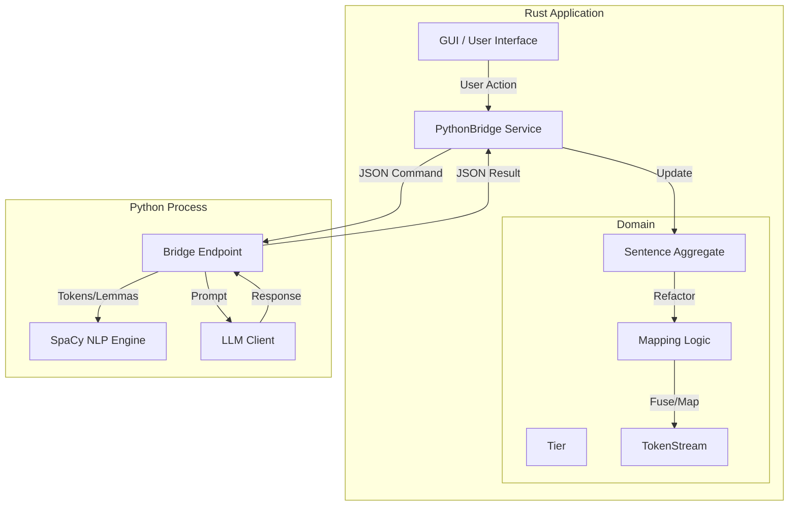
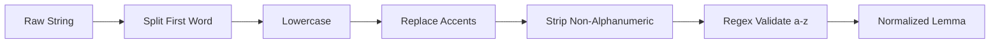

# Data Flow Diagrams

## 1. Rust vs. Python System Overview

This diagram illustrates the separation of concerns between the new Rust-based Domain logic and the existing Python services (NLP, LLM).



## 2. Mapping & Fusion Workflow (`apply_llm_mapping`)

This details the internal logic of `src/domain/mapping_logic.rs`, which replaces the Python `refactor_token_stream` and `align_and_parse_to_atoms`.

```mermaid
graph TD
    Start[Input: Raw LLM Text + TokenStream] --> Parse[Parse LLM Response]
    Parse -->|ParsedMapping[]| ExtractGroups[Extract Source Groups]
    
    subgraph Fusion Process
        ExtractGroups --> Iterate[Iterate Groups]
        Iterate --> Norm[Normalize Group Text]
        Norm --> Lookahead{Fuzzy Match?}
        Lookahead -- Yes (Levenshtein) --> Fuse[Fuse Tokens]
        Lookahead -- No --> Error[Return Error]
        Fuse --> UpdateStream[Update TokenStream]
    end
    
    UpdateStream --> Validate{Count Match?}
    Validate -- No --> Error
    Validate -- Yes --> CreateMap[Create TierMapping]
    
    CreateMap -->|Iterate| CheckNoSub{Is NO_SUB?}
    CheckNoSub -- Yes --> MarkInv[Mark is_viable=False]
    CheckNoSub -- No --> AddEntry[Add MappingEntry]
    
    AddEntry --> Finish[Return TierMapping]
```

## 3. Tier Relationships (V11 Architecture)

This reflects the standardized tier naming convention (removing legacy `simple_target`).

```mermaid
graph LR
    subgraph Source Language (English)
        Base[basic_base]
    end
    
    subgraph Target Language (Spanish)
        Target[basic_target]
    end
    
    Base -->|Forward Mapping| Target
    Target -->|Inverse Mapping| Base
    
    note1[Forward: English IDs -> Spanish Text]
    note2[Inverse: Spanish IDs -> English Text]
    
    Base -.-> note1
    Target -.-> note2
```

## 4. Normalization Pipeline

Ensures consistency between Dictionary lookup and Mapping output.


