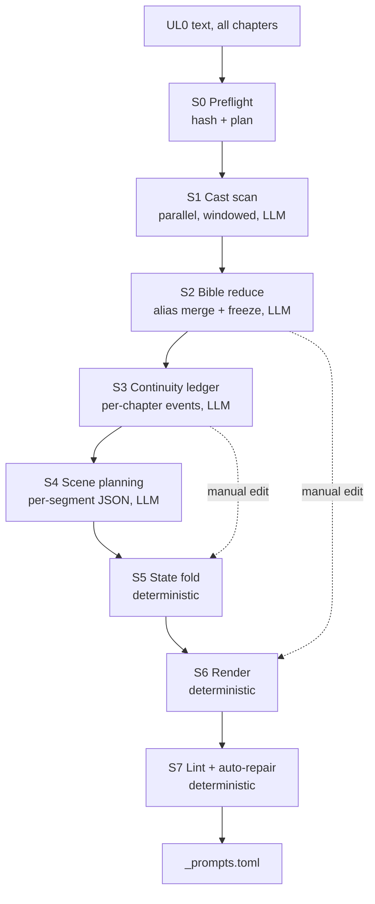

# Illustration Consistency Plan

Structured character/continuity system for illustration prompt generation.

**Status:** Proposed — not yet implemented.
**Goal:** `av generate prompts` produces render-ready, internally consistent prompts
with **zero required user input** and **no post-hoc LLM cleanup pass**.

---

## 1. Problem statement

Today, character appearance drifts between illustrations of the same work:

- A character reads as 12 years old in one image and 22 in another.
- Clothing changes arbitrarily between scenes.
- Age is often not stated at all in the prompt.
- Facial identity is unanchored, so every image invents a new face.

The current workaround is a manual pass: hand the `_prompts` file to an LLM and ask it
to blend two real people per character, fix wardrobe, and spell out ages everywhere.

### Root causes (in the current implementation)

| Cause | Where |
|---|---|
| The LLM re-authors each character description every segment, so paraphrase drift is unavoidable. | [generate_illustration_prompts.py](../generate_illustration_prompts.py#L50) `SYSTEM_PROMPT` asks for a "brief visual reminder" |
| The bible is free prose with no addressable fields — age/wardrobe cannot be asserted. | [extract_characters.py](../extract_characters.py#L31) emits `description` only |
| The bible is chapter-scoped, so cross-chapter continuity is unmodelled. | [extract_characters.py](../extract_characters.py#L74) `load_ul0_text` takes one chapter |
| Segments are independent stateless calls with no memory of prior wardrobe/age. | [generate_illustration_prompts.py](../generate_illustration_prompts.py#L154) `segment_text_for_illustrations` |
| Unspecified traits are re-inferred on every run — nondeterministic. | [extract_characters.py](../extract_characters.py#L31) "infer reasonable visual details" |
| Prompt generation is sequential, one call per segment, uncached. | [generate_illustration_prompts.py](../generate_illustration_prompts.py#L520) |

### Core design principle

> **Stop asking the LLM to be consistent. Make consistency a deterministic rendering
> step the LLM cannot touch.**

The LLM decides *who is on stage, what they are doing, and how the shot is framed*.
Rust decides *what every character looks like*, by injecting frozen bible text verbatim.

---

## 2. Goals and non-goals

### Goals

- One command: `av generate prompts` runs everything unattended.
- Deterministic identity: age, face, hair, and invariants are byte-identical across
  every prompt in which a character appears.
- Context-aware variation: wardrobe and condition legitimately change with the story
  (disguise, mud, injury, aging) without being drift.
- Scales from a 20-sentence fairy tale to a 35,000-sentence novel.
- Incremental: editing one chapter re-runs only that chapter.
- Manual edits are possible and durable, but never required.

### Non-goals

- No interactive prompts or confirmation gates. The run is fully unattended.
- Not changing the `_prompts.toml` consumer contract — [illustration_gen.py](../illustration_gen.py)
  continues to work unmodified.
- Not replacing image generation (stays in Python).

---

## 3. Target architecture



Only S1–S4 call the LLM. S5–S7 are pure computation, which is what makes manual edits
cheap: editing the bible re-runs S6–S7 only, at zero API cost.

---

## 4. Artifacts and file layout

Shared (book-level) artifacts move above the chapter directory. `book_dir` in
[av_producer.rs](../src/services/av_producer.rs#L1090) is currently the *chapter*
directory; a new `book_root_dir()` returns its parent.

```
<book_root>/
  _bible/
    characters.toml        # frozen character bible        (editable, S2)
    locations.toml         # frozen location bible         (editable, S2)
    continuity.toml        # event ledger                  (editable, S3)
    cast_scan/<hash>.json  # S1 per-window cache
    report.md              # merge decisions, timeline, lint summary
    state.json             # content hashes for incremental re-runs
  <Chapter_Name>/
    tts_files/
    illustrations/
      _prompts.toml        # unchanged consumer contract   (S6 output)
      _scenes.json         # structured intermediate       (S4 output)
      _illustration_map.json
      _char_refs/
        <char_id>/<wardrobe_id>.png
```

### 4.1 `characters.toml`

```toml
# Auto-generated character bible. Edit freely.
# Set locked = true on a character to protect ALL its fields from regeneration.
# Set <field>_locked = true to protect a single field.
schema_version = 1

[[character]]
id            = "cosette"
name          = "Cosette"
aliases       = ["the Lark", "Euphrasie", "Mademoiselle Lanoire"]
role          = "deuteragonist"
species       = "human"         # "human" (or empty) vs "brown bear", "wren", "red fox"
prominence    = 0.87            # mention count x window spread, 0..1
locked        = false

canonical_age = 8               # age at first appearance
age_phrase    = "an 8-year-old girl"
age_source    = "text"          # text | inferred

face_blend    = ["<person A>", "<person B>"]
blend_note    = "the bone structure of the first, the eyes of the second"
blend_fallback = "large grey eyes, thin face, high forehead, pointed chin"

hair          = "ash-blonde, unevenly cut to the shoulder"
hair_source   = "inferred"
eyes          = "grey, unusually large"
eyes_source   = "text"
skin          = "pale, faintly hollow-cheeked"
build         = "slight, small for her age"

invariants    = ["unusually large eyes", "thin frame"]
evidence      = [
  "\"her large eyes sunken in a sort of shadow\"",
  "\"she was thin and pale\"",
]

  [character.wardrobe.montfermeil]
  text    = "ragged brown smock, torn apron, bare feet in wooden sabots"
  default = true

  [character.wardrobe.convent]
  text    = "plain black boarder's gown, white collar, hair tied back"

  [character.wardrobe.rue_plumet]
  text    = "well-cut white muslin dress, straw bonnet, gloves"
```

#### Non-human characters

`species` is load-bearing. Folk tales are full of talking animals, and the face-blend
mechanism that anchors a human face becomes actively harmful when applied to one: a
bear given "a face blending Nick Offerman and John C. Reilly" is rendered as a bear
with a man's head. When `species` is anything other than `human`:

| Field | Behaviour |
|---|---|
| `face_blend`, `blend_note`, `blend_fallback` | Forced empty at extraction; ignored at render in every `face_blend_mode`. |
| `canonical_age` | Dropped. "A 10-year-old bear" is not a drawable fact. |
| `age_phrase` | Built from a life stage instead: `"an adult bear"`, `"a newborn chick"`. |
| `hair` | Holds the coat *including its own noun* (`"thick shaggy brown fur"`); the renderer does not append "hair". |
| `skin` | Normally empty; the renderer does not append "skin". |
| — | A species anchor is injected: `"a real brown bear, natural animal anatomy, not anthropomorphic, no human facial features and no human clothing"`. |
| `wardrobe` non-empty | Anchor softens to `"a real brown bear with an animal head and animal features, never a human face"`, so Wind-in-the-Willows dress still works. |

Separately, every field is filtered through a placeholder check. Models answer
inapplicable fields with a literal `"not applicable"` rather than omitting them, which
would otherwise be injected verbatim into every prompt (`"not applicable (fur) skin"`).
`n/a`, `none`, `null`, `unknown` and `not applicable …` are all dropped at extraction
and again at render.

##### Backfill on old bibles (schema 1 → 2)

A bible written before `species` existed leaves the field empty, and empty means
human — so the bear silently gets its celebrity face back the next time prompts are
regenerated. `bible::backfill_species` closes that hole on load, deterministically
and without an API call, and writes the corrected file back so the fix is visible
where the user edits.

A character is reclassified only on evidence, in this order:

1. The head noun of `age_phrase` ("a 10-year-old **bear**"), singularised only when
   the singular is a creature we know — `chicks` → `chick`, but `mice` and `ass` are
   left alone rather than guessed at.
2. A human noun (`king`, `witch`, `dwarf`, `woman`) stops the pass outright. Not
   every non-`human` character wants animal anatomy.
3. A creature noun sets the species directly.
4. Failing both lists, whole-word anatomy markers in `hair`/`eyes`/`skin`/`build`/
   `invariants` — `fur`, `feathers`, `hooves`, `talons`. Whole-word is not fussiness:
   substring matching reads `fin` out of "delicate fingers".

It then clears the face blend, drops `canonical_age`, and rebuilds `age_phrase` as a
life stage. `locked` skips the character entirely; `face_locked` keeps the blend but
logs a warning, because a lock is a deliberate instruction and this pass is a guess.

### 4.1b Ensembles (anonymous crowds)

A `crowd` tableau is not "no cast" — it is *anonymous* cast, and it still needs
consistency (Waterloo's soldiers must look the same in every Waterloo image).
Ensembles live in `locations.toml` and are injected verbatim exactly like a character
card, so no new machinery is required.

```toml
[[ensemble]]
id     = "napoleonic_french_infantry"
text   = "French line infantry in blue coats with white crossbelts, shakos with red plumes"
era    = "1815"
locked = false

[[ensemble]]
id   = "paris_poor_1832"
text = "working poor in patched brown and grey wool, clogs, shawls, flat caps"
```

**`age_phrase` is the load-bearing field.** It is injected verbatim into every prompt,
which is what makes "spell out the age" automatic and assertable.

`face_blend` is the automation of the manual real-people blending step.
`blend_fallback` exists because some image models refuse named real people;
`illustrations.face_blend_mode` selects which renders.

### 4.2 `continuity.toml`

```toml
schema_version = 1

[[event]]
chapter  = "Vol2_Book3_Ch08"
at       = 4102                  # global paragraph index
who      = "cosette"
kind     = "age"                 # age | wardrobe | condition | transform | exit | enter
to       = 14
evidence = "\"Cosette was growing up\""
locked   = false

[[event]]
chapter  = "Vol5_Book3_Ch01"
at       = 9887
who      = "valjean"
kind     = "condition"
to       = "soaked in sewer filth, blood-streaked"
evidence = "\"he emerged covered in mire\""

[[event]]
at   = 9950
who  = "valjean"
kind = "condition"
to   = ""                        # empty string clears the condition
```

Sorted by `at`. Folding all events with `at <= P` yields exact state at paragraph `P`.
This is an event-sourced state machine: O(events), not O(text), so it scales.

### 4.3 `_scenes.json` (S4 output, S6 input)

```jsonc
{
  "schema_version": 1,
  "chapter": "Vol5_Book3_Ch01",
  "scenes": [
    {
      "index": 412,
      "paragraph_start": 9880,
      "paragraph_end": 9930,
      "kind": "cast",                     // cast | tableau
      "cast": [
        { "id": "valjean", "focal": true,  "wardrobe": "auto", "condition": "auto" },
        { "id": "marius",  "focal": false, "wardrobe": "auto", "condition": "unconscious, bleeding from the scalp" }
      ],
      "location": "paris_sewers",
      "action": "carries an unconscious young man across his shoulders through waist-deep water",
      "camera": "low wide shot, torch-lit tunnel receding into blackness",
      "time_of_day": "night",
      "mood": "grim, claustrophobic"
    },
    {
      "index": 413,
      "kind": "tableau",
      "tableau_kind": "crowd",              // place | interior | crowd | object | abstract
      "cast": [],
      "ensembles": ["napoleonic_french_infantry"],
      "location": "waterloo_field",
      "subject": "a sunken road choked with fallen cavalry horses",
      "action": "",
      "camera": "high wide establishing view",
      "time_of_day": "dawn",
      "mood": "desolate"
    }
  ]
}
```

`"auto"` means *resolve from the ledger*. The model overrides only when the segment
itself introduces something new. It never writes face, age, hair, or invariants.

### 4.4 `state.json`

```jsonc
{
  "schema_version": 1,
  "chapters": { "Vol1_Book1_Ch01": { "text_sha": "ab12…", "paragraphs": 412 } },
  "stages": {
    "cast_scan":  { "input_sha": "…", "completed_at": "…" },
    "bible":      { "input_sha": "…", "output_sha": "…" },
    "continuity": { "input_sha": "…", "output_sha": "…" },
    "scenes":     { "Vol1_Book1_Ch01": { "input_sha": "…" } },
    "render":     { "bible_sha": "…", "continuity_sha": "…", "scenes_sha": "…" }
  }
}
```

`render` keys off the *outputs* of the earlier stages. That is what makes a manual
bible edit trigger a free re-render and nothing else.

---

## 5. Stage specifications

### S0 — Preflight (no LLM)

1. Enumerate chapters under `book_root`, load UL0 per chapter via existing
   `load_ul0_text` logic (port the copy-file-avoidance heuristics from
   [generate_illustration_prompts.py](../generate_illustration_prompts.py#L74)).
2. Split to paragraphs; assign **global** paragraph indices across the whole book.
3. SHA-256 per chapter; diff against `state.json`.
4. Print the plan and proceed immediately — no confirmation.

```
Les_Miserables — 48 chapters, 34,812 sentences
  cast scan   : 174 windows   (12 cold, 162 cached)
  continuity  : 48 chapters   (1 cold, 47 cached)
  scene plan  : 697 segments  (15 cold, 682 cached)
  render+lint : 697 prompts   (always)
```

### S1 — Cast scan (LLM, parallel, cached)

- Window size `cast_scan_window` (default 200 paragraphs), overlap `cast_scan_overlap`
  (default 20).
- Prompt: *identify every character present; quote any text describing appearance.*
  **Do not write descriptions — only harvest quotes.** Facts vs. inventions must stay
  separable.
- Output per window: `{ name, aliases[], evidence[], prominence }`.
- Cache key = SHA of window text + prompt version + model. Store under
  `_bible/cast_scan/<hash>.json`.
- Concurrency `prompt_concurrency` (default 8). Model `cast_scan_model`
  (default `gemini-2.5-flash-lite`) — cheap, since it only extracts.

### S2 — Bible reduce (LLM, single pass)

1. **Alias resolution.** Merge sightings into canonical ids. Highest-risk step —
   see §9. Feed alias evidence quotes, require a merge rationale per group.
2. **Prominence filter.** Keep top `max_bible_characters` (default 40) as full
   entries; the remainder become a thin minor-cast list (name + one clause) so they
   do not bloat prompts.
3. **Slot filling.** Populate the schema. Conflict rule: explicit textual evidence
   beats inference; earliest explicit evidence wins; inference fills empty slots only.
   Record `<field>_source`.
4. **Face blends.** Assign pairs with a global uniqueness constraint — no two
   characters share a blend member. Also emit `blend_fallback`.
5. **Wardrobe variants.** Derive named outfits from evidence; mark one `default`.
6. **Merge with existing file.** Any character or field with `locked = true` is
   preserved verbatim. This is the manual-edit durability guarantee.
7. Same treatment produces `locations.toml` for recurring settings.

### S3 — Continuity ledger (LLM, per-chapter, parallel)

- One call per chapter, seeded with the cast state implied by S1 window ordering, so
  chapters need not run strictly sequentially.
- Emit **events only**, each with an `evidence` quote and a paragraph anchor.
- Validation (deterministic, post-hoc):
  - `at` must be within the chapter's paragraph range.
  - `who` must exist in the bible.
  - `wardrobe` targets must be declared variants (else auto-create the variant and
    warn).
  - Drop events whose `evidence` quote is not found in the source text — bias
    conservative, since a hallucinated wardrobe change is worse than a missed one.
- Reconcile cross-chapter contradictions (e.g. two conflicting ages at the same `at`):
  keep the one with textual evidence, warn on both.
- Merge with existing file, preserving `locked = true` events.

### S4 — Scene planning (LLM, parallel, cached)

- Segmentation as today ([generate_illustration_prompts.py](../generate_illustration_prompts.py#L154)),
  with an opt-in duration-based mode (see §5.1). Illustration density stays a per-book
  setting via `sentences_per_illustration`.
- Input per segment: segment text, ±`context_radius` surrounding paragraphs (existing
  `build_scene_context`), the **resolved cast state at that paragraph** (from S5), and
  the minor-cast list.
- Output: structured JSON per §4.3, via Gemini `responseSchema` structured output —
  no free-text scraping.
- Segments with no bible cast emit `"kind": "tableau"` — see §5.2.
- Cache key = SHA of (segment text + context + resolved state + prompt version + model).
- Reuse the retry/fallback-model and `soften_sensitive_language` behaviour from
  [generate_illustration_prompts.py](../generate_illustration_prompts.py#L224).

### S4.1 — Segmentation pacing (deterministic)

[create_video.py](../create_video.py#L191) derives **variable per-image duration** from
`_illustration_map.json`, so an image is on screen for as long as its sentence range
takes to narrate. Current segmentation divides by *paragraph count*, but equal
paragraph counts are not equal audio time: digression paragraphs are long prose blocks,
dialogue paragraphs are one-line sentences. The result is that the least visually
interesting stretches of a book get the **most** screen time per image.

Add `segment_by`:

- `"sentences"` (default) — current behaviour, preserved so existing books keep their
  tuned image counts.
- `"duration"` — segment on estimated spoken length (character count as proxy, or the
  real chunk durations from `_chunk_map.json` when TTS has already run). Deterministic,
  one function, and it fixes tableau pacing globally as a side effect.

### S4.2 — Tableau scenes

Tableau segments **cannot be skipped** — the video requires continuous visual coverage.
The only question is what to show. Do not treat tableau as one bucket; `tableau_kind`
routes to a different render template:

| `tableau_kind` | Example | Driven by |
|---|---|---|
| `place` | the field of Waterloo, the Paris sewers | `locations.toml` |
| `interior` | the convent, the barricade under construction | `locations.toml` |
| `crowd` | the battle, the funeral mob, the congregation | `[[ensemble]]` entries |
| `object` | a letter, the bishop's candlesticks, a coin | still life |
| `abstract` | the argot chapter, the essay on monasticism | see below |

**Rules for the S4 prompt on tableau segments:**

1. **Concrete referent only.** For `abstract`, the planner must choose something
   *physically present in the passage text* and put it in `subject`. It may **not**
   invent a symbol, allegory, or metaphorical composition. Even the argot chapter
   contains thieves' dens, chalk marks, and night alleys. This is the single most
   important tableau rule — symbolic imagery is where image models produce surreal
   output and where the storybook register breaks.
2. **Empty cast is stated explicitly.** The planner is told the cast list is empty and
   that naming a bible character is a hard error. The ±`context_radius` window will
   mention nearby characters, and dragging them in is the dominant tableau failure mode.
3. **No repeats.** The previous tableau's `subject` is passed in, and a different
   concrete subject is required. Three segments into a digression this is what prevents
   three near-identical atmospheric images.
4. **Crowds reference ensembles by id**, never free-text descriptions of period dress.

### S5 — State fold (deterministic, free)

`resolve_state(char_id, paragraph) -> ResolvedState { age, age_phrase, wardrobe_text, condition }`

Fold all events with `at <= paragraph`, in order, per character. Age changes
regenerate `age_phrase` from a template. Pure function, trivially unit-testable.

### S6 — Render (deterministic, free)

**Cast scenes** (`kind = "cast"`):

```
{style_prefix}. {focal_cards}. {background_clauses}. {location_text}.
{action}. {camera}, {time_of_day} light. {mood}.
```

- **Focal card** (full): `{name}, {age_phrase} with {build}, {hair}, {eyes}, {skin},
  {face}, {invariants} — wearing {wardrobe_text}{, condition}`
  where `{face}` is `face_blend` or `blend_fallback` per `face_blend_mode`.
- **Background clause** (compact): `{name}, {age_phrase}, {wardrobe_text}` only.
- Limit to `max_focal_cards` (default 2) full cards to avoid prompt bloat; rank by
  `focal` then bible `prominence`.

**Tableau scenes** (`kind = "tableau"`):

```
{style_prefix}, {tableau_style[tableau_kind]}. {location_text}{ensemble_clauses}.
{subject}. {camera}, {time_of_day} light. {mood}.
```

Style is **modified, never replaced** — `style_prefix` stays global so the medium and
palette hold across the whole book, and only the *composition* modifier varies by
`tableau_kind`. Swapping art style for a Waterloo panorama would make the finished
video look like two different books. `ensemble_clauses` are injected verbatim from
`locations.toml`, exactly like character cards.

**Both kinds:**

- Camera/time-of-day variety: if the model returns a repeated camera value more than
  `camera_repeat_limit` (default 3) times consecutively, rotate through a deterministic
  alternate list. Over-constraint otherwise makes every image look the same.
- Emit `_prompts.toml` in the existing schema (`index`, `text`, `style`,
  `paragraph_start`, `paragraph_end`) so [illustration_gen.py](../illustration_gen.py)
  is unaffected. Add optional `cast` and `wardrobe` keys for the ref-image step.

### S7 — Lint and auto-repair (deterministic, free)

| Rule | Severity | Auto-repair |
|---|---|---|
| Every focal character's `age_phrase` present verbatim | error | re-inject card |
| Every `invariant` of every focal character present | error | re-inject card |
| `wardrobe` id is a declared variant | error | fall back to default |
| No character named who is not in the resolved on-stage set | error | strip clause |
| No banned tokens (`text`, `speech bubble`, `panel`, `collage`, `two scenes`, `caption`) | error | strip |
| Style prefix present exactly once | error | fix |
| Prompt length within `max_prompt_chars` | warn | demote focal → compact |
| **Tableau: no bible character named at all** | error | strip only, no re-inject |
| **Tableau: `subject` is non-empty and appears in the prompt** | error | re-ask |
| **Tableau: `subject` differs from the previous tableau's** | warn | re-ask once |
| **Tableau: `ensembles` ids are declared in `locations.toml`** | error | drop id |

If auto-repair cannot satisfy a rule, issue **one** bounded re-ask listing the specific
failures. Never more than `lint_repair_attempts` (default 1).

This stage is what converts "usually consistent" into "provably consistent", and is
the concrete replacement for the manual cleanup pass.

---

## 6. Code changes

### 6.1 New Rust module tree

```
src/services/illustration/
  mod.rs           # public API + re-exports
  types.rs         # Bible, Character, Wardrobe, Event, Scene, ResolvedState
  bible.rs         # load/save/merge characters.toml + locations.toml, lock semantics
  state.rs         # state.json, SHA hashing, staleness computation
  cast_scan.rs     # S1
  bible_reduce.rs  # S2
  continuity.rs    # S3 emit + validate + fold (S5)
  scene_plan.rs    # S4
  render.rs        # S6
  lint.rs          # S7
  orchestrator.rs  # S0 + stage sequencing + progress reporting
```

Reuse existing infrastructure rather than rebuilding it:

- LLM calls + disk cache: [llm_client.rs](../src/services/llm_client.rs#L197) already
  hashes `(model, system, user)` into `.llm_cache/`.
- Batching, retry, fallback model, cancel flag: [llm_stage.rs](../src/services/llm_stage.rs#L22)
  `generate_for_items`. Extend it with a concurrent variant, or add a sibling
  `generate_concurrent` — S1/S3/S4 are all embarrassingly parallel.
- Prompt templates: move the inline `SYSTEM_PROMPT` strings out to
  `assets/prompts/illustration/{cast_scan,bible_reduce,continuity,scene_plan,repair}.txt`
  so `PromptManager` handles them and they are versionable (the prompt version feeds
  the cache key).

### 6.2 Changes to existing files

- [av_producer.rs](../src/services/av_producer.rs#L1090) — add `book_root_dir()`;
  replace `spawn_prompts` with an in-process call to
  `illustration::orchestrator::run()`. Keep `spawn_extract_characters` temporarily as
  a deprecated alias that now just runs S1+S2.
- [av_producer.rs](../src/services/av_producer.rs#L1200) `spawn_illustrations` — pass
  per-wardrobe ref images.
- [engine.rs](../src/app/engine.rs#L3732) — `AvGeneratePrompts` handler drives the
  orchestrator, streaming stage progress into the existing `AvJobState` so
  `job_status` / `wait` keep working.
- [terminal.rs](../src/app/terminal.rs#L1252) — add `av bible show|edit|lock|unlock`
  and `av generate prompts --force [stage]`.
- [illustration_gen.py](../illustration_gen.py#L87) — generate one reference portrait
  **per wardrobe variant**, not one per character; select refs by the `cast` +
  `wardrobe` keys now present in `_prompts.toml`, ranked to fit the ~4-image cap.

### 6.3 Config additions

Extend `IllustrationsConfig` in [av_producer.rs](../src/services/av_producer.rs#L78).
All `#[serde(default)]` so existing manifests keep loading.

```toml
[illustrations]
# --- existing ---
style_prefix              = "fairy tale watercolor, storybook illustration, warm lighting"
prompt_model              = "gemini-2.5-flash"
image_model               = "gemini-3.1-flash-image-preview"
image_size                = "2K"
image_aspect_ratio        = "16:9"
sentences_per_illustration = 50
minimum_count             = 3
concurrent_requests       = 1

# --- new ---
segment_by                = "sentences" # sentences | duration  (see S4.1)
max_illustrations         = 0          # 0 = uncapped; density is set per book via
                                       # sentences_per_illustration. Safety net only.
cast_scan_model           = "gemini-2.5-flash-lite"
cast_scan_window          = 200
cast_scan_overlap         = 20
max_bible_characters      = 40
prompt_concurrency        = 8
face_blend_mode           = "blend"    # blend | fallback | off
max_focal_cards           = 2
max_prompt_chars          = 1200
camera_repeat_limit       = 3
context_radius            = 25
lint_repair_attempts      = 1
enable_location_bible     = true

# Composition modifiers appended to style_prefix for tableau scenes.
# The art style itself is never replaced — only the framing varies.
[illustrations.tableau_style]
place    = "wide establishing view, no figures in the foreground"
interior = "architectural interior study, soft depth, no figures in the foreground"
crowd    = "distant figures, no individual faces in focus"
object   = "still life, shallow depth of field, single subject"
abstract = "atmospheric and evocative, a single concrete subject"
```

---

## 7. Unattended operation and manual edits

Unattended is the default and only path — no gates, no prompts.

Manual edits are supported through three mechanisms:

1. **Lock flags.** `locked = true` on a character, a single field
   (`hair_locked = true`), or a continuity event. Locked data survives regeneration.
   This fixes today's "re-running overwrites your edits" behaviour.
2. **Free re-render.** Because S5–S7 are deterministic, editing `characters.toml` and
   re-running costs **zero API calls** — `state.json` sees the bible SHA changed and
   the scene SHAs unchanged, so only S6–S7 re-run. A 700-prompt novel re-renders in
   seconds.
3. **`report.md`.** Leads with alias-merge decisions and their evidence, then the
   continuity timeline, then lint results. A 30-second read catches the failure modes
   that matter, and each fix is a one-line TOML edit.

---

## 8. Phasing

### Phase 1 — Deterministic identity (largest win / least work) — **DONE**

No new LLM passes. Fixes age drift, wardrobe drift, and the manual face-blend step for
small and medium works.

- [x] `types.rs` — bible schema structs, serde round-trip.
- [x] `bible.rs` — load/save/merge with lock semantics.
- [x] `extract.rs` — structured extraction schema (age_phrase, face_blend, invariants,
      wardrobe variants) instead of prose.
- [x] `render.rs` — focal/compact card rendering, style prefix, camera rotation.
- [x] `lint.rs` — all rules in §5 S7 plus auto-repair.
- [x] `segment.rs` — UL0 discovery, paragraph split, sentence/duration segmentation.
- [x] `llm.rs` — JSON extraction, model fallback, ordered concurrent map.
- [x] `scene_plan.rs` — structured scene JSON with deterministic fallback.
- [x] `output.rs` — `_prompts.toml`, `_illustration_map.json`, `_scenes.json`, `report.md`.
- [x] `orchestrator.rs` — full pipeline, bible-only mode, scene-plan reuse.
- [x] Wire `av generate prompts` / `av generate characters` to run in-process, streaming
      into the existing AV job state so `av log`, `job_status` and `av cancel` work.
- [x] `report.md` generation.

Brought forward from Phase 2 because they were cheap once the module existed:
structured scene planning, tableau sub-typing + `tableau_style` modifiers, the
concrete-referent / empty-cast / anti-repeat rules, `[[ensemble]]` entries, and
`segment_by = "duration"`.

**Not yet wired:** `orchestrator::rerender` is implemented but has no CLI verb; the
equivalent is reached automatically because `av generate prompts` reuses a matching
`_scenes.json` and re-renders for free. `spawn_prompts` / `spawn_extract_characters`
(the Python child-process paths) are left in place but no longer called.

**Usage:**

```
set title The Willow Wren and the Bear   # or Preferences → Story Metadata...
av generate characters          # rebuild _bible/characters.toml, honouring locks
av generate prompts             # reuse bible + scene plan where valid, re-render free
av generate prompts force       # rebuild the bible and re-plan every scene
```

### Phase 1b — YouTube key art

Every work gets two extra prompts appended after the scene prompts:

| file | contents |
|---|---|
| `_thumbnail.jpg` | representative key art carrying the title |
| `_thumbnail_diglot.jpg` | the same image plus a `diglot` badge |

The key-art *scene* is one LLM call per work (`thumbnail.rs`), given a
beginning/middle/end digest rather than a prefix, because key art showing the
opening scene misrepresents the book. It is then rendered through the same
`render_scene` as every other prompt, so the characters on the thumbnail are
described with the same verbatim bible text as the characters inside the video.
The planned scene is stored in `_scenes.json` under `thumbnail`, so re-running
costs no API call.

The title itself is injected deterministically, quoted exactly, with an explicit
"no other words appear anywhere in the image" — a model given a vague brief
renders plausible-looking gibberish. In chapter mode the chapter name is printed
beneath the work title at roughly half the size.

The diglot variant lists the plain thumbnail in `ref_files`, so the image model
is given the finished picture and asked to add a badge, rather than being asked
twice for the same brief and producing two different pictures.

Three consequences worth remembering:

- Thumbnails are **excluded from `_illustration_map.json`**. That file drives the
  video timeline, and a title card has no place in it. `create_video.py` also
  skips any `_`-prefixed image in its directory-scan fallback.
- `_prompts.toml` gained four optional per-prompt keys — `kind`, `file`,
  `resize`, `ref_files` — all omitted when empty, so ordinary scene prompts
  serialise byte-identically to the previous schema.
- `av generate prompts` **refuses to run** without a story title. `book_name` is
  a filename slug and is unfit to print; the title lives in the `.wvl` as
  `story_title`, set from Preferences → Story Metadata or `set title <text>`.

Manifest keys (`[illustrations]`, all optional):

```toml
thumbnails     = true        # emit the pair at all
thumbnail_size = "1280x720"  # exact output pixels; JPEG quality drops to fit 2 MB
diglot_label   = "diglot"    # the word on the badge
```

**Acceptance:** on a Grimm's tale, every prompt containing a character contains that
character's `age_phrase` and all invariants verbatim; lint reports 0 errors; no manual
cleanup produces a visible improvement.

### Phase 2 — Continuity and scale

Fixes long-form: aging, wardrobe changes, cross-chapter identity.

- [ ] `state.rs` — hashing and incremental staleness.
- [ ] `cast_scan.rs` — windowed parallel scan with per-window cache.
- [ ] `bible_reduce.rs` — alias resolution, prominence filter, blend uniqueness.
- [ ] `continuity.rs` — event emission, evidence validation, cross-chapter reconcile,
      and the fold (`render::resolve_state` currently reads the bible only).
- [ ] Book-level artifact layout + `book_root_dir()` (the bible is per-chapter today).
- [ ] Concurrent LLM helper in `llm_stage.rs`.

**Acceptance:** on Les Misérables, Cosette renders as 8 at Montfermeil and ~17 on the
Rue Plumet without manual intervention; Valjean's aliases resolve to one character;
Valjean is filthy in the sewer scenes and clean immediately after; the Waterloo and
argot digressions produce concrete, non-repeating tableaux naming no bible character;
re-running with no text change makes zero API calls.

### Phase 3 — Locations and visual anchoring

- [ ] `locations.toml` with the same freeze/lock treatment.
- [ ] Per-wardrobe reference portraits in [illustration_gen.py](../illustration_gen.py).
- [ ] Ref selection and ranking against the Gemini image cap.
- [ ] `av bible` CLI surface.

**Acceptance:** recurring settings are visually stable across chapters; Cosette-at-8
and Cosette-at-17 anchor to two distinct reference portraits.

---

## 9. Risks and mitigations

| Risk | Impact | Mitigation |
|---|---|---|
| **Alias resolution failure.** Les Mis deliberately conceals that Valjean, Madeleine, Leblanc and Fauchelevent are one man. A split yields three different faces. | High | Feed alias evidence quotes; require a merge rationale; lead `report.md` with merge decisions; merging is a one-line edit plus a free re-render. |
| Prompt bloat — full cards for several characters swamp the scene. | Medium | `max_focal_cards`, compact background clauses, `max_prompt_chars` lint demotion. |
| Over-constraint makes every image look identical. | Medium | Camera/time-of-day variation with deterministic rotation on repeats. |
| Hallucinated continuity events. | Medium | Required evidence quote, verified present in source text; anchor range validation; drop on failure. |
| Image model refuses named real people. | Medium | `blend_fallback` physiognomy description always stored; `face_blend_mode` switch. |
| Cost of the new scan passes on huge works. | Medium | Cheap extraction-only model, events-only output, per-window content-hash cache, incremental re-runs. |
| Long digressions with no cast. | Medium | Sub-typed `tableau_kind` with dedicated render templates; concrete-referent rule; anti-repeat rule. |
| Bible characters leak into tableau prompts via the context window. | Medium | Explicit empty-cast instruction in S4; strip-only lint error. |
| Digressions get the most screen time per image (long prose paragraphs). | Medium | Opt-in `segment_by = "duration"`. |
| Image count on a novel. | Low | Density is set per book via `sentences_per_illustration`; `max_illustrations` exists only as an off-by-default safety net. |

---

## 10. Testing

- **Unit (pure, no network):**
  - `resolve_state` fold — ordering, clears, conflicting events, boundary at exactly `at == P`.
  - `render` — card assembly, focal ranking, compact demotion, camera rotation, and
    each `tableau_kind` template.
  - `segment_by = "duration"` — equal-audio partitioning, and parity with `"sentences"`
    on a uniform fixture.
  - `lint` — one test per rule, plus auto-repair round-trip.
  - `bible` merge — lock semantics at character and field level.
  - `state` — staleness matrix (text changed / bible changed / nothing changed).
- **Golden-file:** a small fixture book with a known cast; assert byte-stable
  `_prompts.toml` across runs given a fixed bible. This directly guards the
  no-drift property.
- **Mock LLM:** the existing `MockLlmProvider` path in
  [llm_stage.rs](../src/services/llm_stage.rs#L34) (`set_context`) lets S1–S4 run
  against canned responses in CI.
- **Manual:** one short work (Grimm's) end-to-end, and one long work (Les Mis) for
  alias resolution and aging.

---

## 11. Resolved decisions

- **Illustration density** is set per book by the user via `sentences_per_illustration`
  (higher on longer works). No automatic scaling. `max_illustrations` defaults to `0`.
- **Tableau style** modifies rather than replaces `style_prefix` — the art medium is
  held constant book-wide and only the composition varies by `tableau_kind`.
- **Tableau segments are never skipped**, because `create_video.py` requires continuous
  visual coverage.
- **Operation is fully unattended** — no confirmation gates. Manual edits are possible
  via lock flags and cost nothing to apply.

## 12. Open questions

1. Should the bible be per-book or per-series? A series (e.g. multiple Grimm tales
   sharing archetypes) might benefit from a shared blend pool to avoid repeated faces.
2. Should `report.md` be regenerated on every run, or only when merges change?
3. Should `segment_by = "duration"` prefer real `_chunk_map.json` durations when TTS has
   already run, or always use the character-count proxy for determinism?
