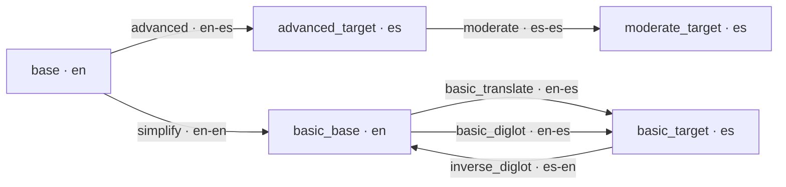
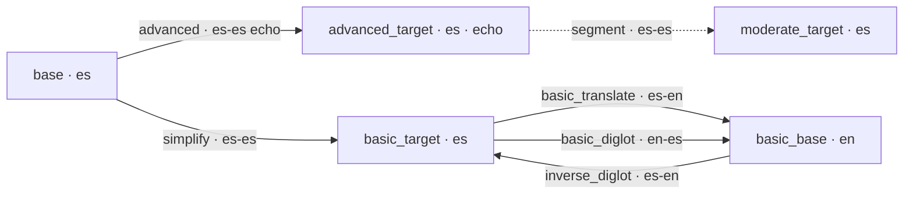

# Prompt Flow and Asset Layout

This document is the single, authoritative map of **which LLM prompt file runs at
each pipeline step**, and **why the same prompt name lives in different
directories**.

> Related: [Data_Flow_Diagrams.md](Data_Flow_Diagrams.md) (tier dependency graphs),
> `src/services/tier_graph.rs` (the code that resolves stage → prompt).

---

## 1. The core idea: directory = language direction, name = function

Every prompt is loaded from:

```
assets/prompts/{input_lang}-{output_lang}/{prompt_name}.txt
```

- **`{input_lang}-{output_lang}`** encodes the *language direction* of the step —
  the language it reads versus the language it writes. It is **not** the master
  project language pair.
- **`{prompt_name}`** names the step's **function (+ complexity level)**, not the
  tier slot it happens to fill.

The pair **(directory, name)** uniquely identifies an operation. The directory
decides whether a translation is bundled in:

- A `simplify` prompt in a **same-language** directory (`a-a`) only simplifies.
- A `simplify` prompt in a **cross-language** directory (`a-b`) simplifies **and**
  translates.

| Name              | `en-en`          | `es-es`          | `en-es`               | `es-en`            |
|-------------------|------------------|------------------|-----------------------|--------------------|
| `simplify`        | simplify English | simplify Spanish | simplify + translate  | simplify + translate |
| `basic_translate` | —                | —                | translate en → es     | translate es → en  |

Naming by function (not tier role) removes duplicate-content files: e.g. the
simplify-only English prompt is a single `en-en/simplify.txt`, whether it feeds
`basic_base` (en-source) or `basic_target` (es→en learners with an English source).

If a prompt is missing in its `{input}-{output}` directory, `PromptManager` falls
back to `assets/prompts/_defaults/{prompt_name}.txt`.

---

## 2. The standardized prompt names

Names encode **function + complexity level**; the directory encodes language
direction. `moderate` and `simplify` are both same-language simplifications but stay
distinct because they target different levels and I/O granularity.

| Name              | Function                                                              |
|-------------------|----------------------------------------------------------------------|
| `advanced`        | Produce the advanced (literary) target tier.                         |
| `segment`         | Split text into study segments (universal segmenter).                |
| `moderate`        | Simplify the advanced target into the moderate tier (segment-level). |
| `simplify`        | Simplify source → a **basic** tier (sentence-level). Translates too if dir is `a-b`. |
| `basic_translate` | Translate one basic tier → the other (simplification already done).  |
| `basic_diglot`    | Forward diglot phrase map (`basic_base` → `basic_target`).           |
| `inverse_diglot`  | Inverse diglot phrase map (`basic_target` → `basic_base`).           |

**Basic-branch dispatch rule** (direction-agnostic): a stage whose `source_tier`
is `base` runs `simplify`; a stage between two basic tiers runs `basic_translate`.

(`lesson_realign_tts` exists under `en-es/` but is out of the main generation flow.)

---

## 3. Live asset tree

```
assets/prompts/
├── en-en/
│   ├── simplify.txt          # simplify English (same-language)
│   └── segment.txt           # universal segmenter (copy)
├── en-es/
│   ├── advanced.txt          # en → es literary translate
│   ├── basic_translate.txt   # en → es basic translate
│   ├── basic_diglot.txt      # en → es forward diglot map
│   └── lesson_realign_tts.txt# (out of flow)
├── es-en/
│   ├── basic_translate.txt   # es → en basic translate
│   └── inverse_diglot.txt    # es → en inverse diglot map
├── es-es/
│   ├── advanced.txt          # es echo (segmentation only)
│   ├── simplify.txt          # simplify Spanish (same-language)
│   ├── moderate.txt          # es moderate simplify (segment-level)
│   └── segment.txt           # Spanish segmentation
└── _defaults/
    └── segment.txt           # universal fallback segmenter
```

> Future: a third-language source (e.g. a French document for English learners of
> Spanish) just adds `fr-es/simplify.txt` (simplify + translate) — no new prompt
> *names* are needed.

All previous prompt files were archived to `stashed/legacy_prompts/`.

---

## 4. Stage → prompt resolution

The Rust engine never hardcodes a directory. For each stage it calls
`tier_graph::stage_dispatch` to get the `prompt_name` and the source/target tiers,
then `tier_graph::prompt_pair_for_stage` to compute `{input}-{output}`:

```
input_lang  = lang_for_tier(source_tier)
output_lang = lang_for_tier(effective_target_tier)
```

For `MAPPING:a:b` stages (diglot / inverse-diglot) the **effective target is `b`**,
so the directory follows the diglot's weave direction.

### English-source — `project_languages = (en, es)`



| Stage                       | name              | dir     |
|-----------------------------|-------------------|---------|
| GenerateAdvancedTarget      | `advanced`        | `en-es` |
| GenerateModerateTarget      | `moderate`        | `es-es` |
| GenerateBasicBase           | `simplify`        | `en-en` |
| GenerateBasicTarget         | `basic_translate` | `en-es` |
| GeneratePhraseMap           | `basic_diglot`    | `en-es` |
| GenerateInversePhraseMap    | `inverse_diglot`  | `es-en` |

### Spanish-source — `project_languages = (es, es)` (author-driven lessons)

The basic branch reverses; the advanced step degenerates to a verbatim echo and the
real segmentation is done by `es-es/segment.txt`.



| Stage                       | name              | dir     |
|-----------------------------|-------------------|---------|
| GenerateAdvancedTarget      | `advanced`        | `es-es` |
| GenerateModerateTarget      | `moderate`        | `es-es` |
| GenerateBasicTarget         | `simplify`        | `es-es` |
| GenerateBasicBase           | `basic_translate` | `es-en` |
| GeneratePhraseMap           | `basic_diglot`    | `en-es` |
| GenerateInversePhraseMap    | `inverse_diglot`  | `es-en` |

> Note: the diglot directories (`en-es` / `es-en`) are the **same** in both modes —
> the phrase map always weaves learner-language (`en`) ↔ target (`es`).

---

## 5. Segmentation

`segment` is run by the segmenter service after `GenerateAdvancedTarget`. It always
loads from `{output_lang}-{output_lang}` (e.g. `es-es/segment.txt`) because it
segments the produced target text. `en-en/segment.txt` and `_defaults/segment.txt`
are copies of the same universal segmenter for fallback.

---

## 6. Simple mode and simple_triple mode (subsets)

In `simple_mode`, `moderate` is skipped and only the basic tiers are produced. When
the output is **non-diglot**, only the `simplify` step runs (no `basic_translate` /
diglot maps). All names and directories are unchanged — simple mode just runs a
subset of the same stages.

`simple_triple` mode (planned) turns `basic_base` off entirely and produces only a
single basic tier via `simplify` (which simplifies-and-translates when the source
language differs from the basic-tier language). See
`documentation/Simple_Triple_Mode_Plan.md` for the full behavior.

---

## 7. Mocked test fixtures

Canned LLM responses for integration tests live in
`test_case/test_01/LLM_responses/` and are named after the **prompt function**
(`advanced.txt`, `simplify.txt`, `basic_translate.txt`, `basic_diglot.txt`,
`inverse_diglot.txt`, `moderate.txt`, `segment.txt`). `MockLlmProvider` resolves a
response by `<prompt_name>.txt`. Regenerate them with `build_mocks_new.py`.
