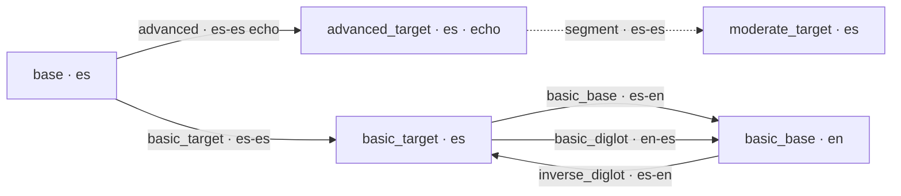

# Prompt Flow and Asset Layout

This document is the single, authoritative map of **which LLM prompt file runs at
each pipeline step**, and **why the same prompt name lives in different
directories**.

> Related: [Data_Flow_Diagrams.md](Data_Flow_Diagrams.md) (tier dependency graphs),
> `src/services/tier_graph.rs` (the code that resolves stage → prompt).

---

## 1. The core idea: directory = the *operation*, name = the *role*

Every prompt is loaded from:

```
assets/prompts/{input_lang}-{output_lang}/{prompt_name}.txt
```

- **`{input_lang}-{output_lang}`** encodes the *actual per-step operation* — the
  language the step reads versus the language it writes. It is **not** the master
  project language pair.
- **`{prompt_name}`** is one of **7 standardized names** (below) that describes the
  *role* the output plays in the tier ladder.

The pair **(directory, name)** uniquely identifies an operation. The same name in
two directories is a **different operation**:

| Name         | `en-en`              | `es-en`            | `en-es`            | `es-es`              |
|--------------|----------------------|--------------------|--------------------|----------------------|
| `basic_base` | simplify English     | translate es → en  | —                  | —                    |
| `basic_target`| —                   | —                  | translate en → es  | simplify Spanish     |
| `advanced`   | —                    | —                  | translate en → es  | echo (segment only)  |

So `basic_base` is a **simplification** in `en-en` but a **translation** in `es-en`.
That ambiguity is intentional and is resolved entirely by the directory.

If a prompt is missing in its `{input}-{output}` directory, `PromptManager` falls
back to `assets/prompts/_defaults/{prompt_name}.txt`.

---

## 2. The 7 standardized prompt names

| Name             | Role                                                                 |
|------------------|---------------------------------------------------------------------|
| `advanced`       | Produce the advanced (literary) target tier.                        |
| `segment`        | Split text into study segments (universal segmenter).               |
| `moderate`       | Simplify the advanced target into the moderate tier (segment-level).|
| `basic_base`     | Produce the basic **base** (learner-language) tier.                 |
| `basic_target`   | Produce the basic **target** tier.                                  |
| `basic_diglot`   | Forward diglot phrase map (`basic_base` → `basic_target`).          |
| `inverse_diglot` | Inverse diglot phrase map (`basic_target` → `basic_base`).          |

(`lesson_realign_tts` exists under `en-es/` but is out of the main generation flow.)

---

## 3. Live asset tree

```
assets/prompts/
├── en-en/
│   ├── basic_base.txt        # simplify English
│   └── segment.txt           # universal segmenter (copy)
├── en-es/
│   ├── advanced.txt          # en → es literary translate
│   ├── basic_target.txt      # en → es basic translate
│   ├── basic_diglot.txt      # en → es forward diglot map
│   └── lesson_realign_tts.txt# (out of flow)
├── es-en/
│   ├── basic_base.txt        # es → en translate
│   └── inverse_diglot.txt    # es → en inverse diglot map
├── es-es/
│   ├── advanced.txt          # es echo (segmentation only)
│   ├── basic_target.txt      # simplify Spanish
│   ├── moderate.txt          # es moderate simplify (segment-level)
│   └── segment.txt           # Spanish segmentation
└── _defaults/
    └── segment.txt           # universal fallback segmenter
```

All previous prompt files were archived to `stashed/legacy_prompts/`.

---

## 4. Stage → prompt resolution

The Rust engine never hardcodes a directory. For each stage it calls
`tier_graph::stage_dispatch` to get the `prompt_name` and the source/target tiers,
then `tier_graph::prompt_pair_for_stage` to compute `{input}-{output}`:

```
input_lang  = lang_for_tier(source_tier)
output_lang = lang_for_tier(effective_target_tier)
```

For `MAPPING:a:b` stages (diglot / inverse-diglot) the **effective target is `b`**,
so the directory follows the diglot's weave direction.

### English-source — `project_languages = (en, es)`


| Stage                       | name             | dir     |
|-----------------------------|------------------|---------|
| GenerateAdvancedTarget      | `advanced`       | `en-es` |
| GenerateModerateTarget      | `moderate`       | `es-es` |
| GenerateBasicBase           | `basic_base`     | `en-en` |
| GenerateBasicTarget         | `basic_target`   | `en-es` |
| GeneratePhraseMap           | `basic_diglot`   | `en-es` |
| GenerateInversePhraseMap    | `inverse_diglot` | `es-en` |

### Spanish-source — `project_languages = (es, es)` (author-driven lessons)

The basic branch reverses; the advanced step degenerates to a verbatim echo and the
real segmentation is done by `es-es/segment.txt`.



| Stage                       | name             | dir     |
|-----------------------------|------------------|---------|
| GenerateAdvancedTarget      | `advanced`       | `es-es` |
| GenerateModerateTarget      | `moderate`       | `es-es` |
| GenerateBasicTarget         | `basic_target`   | `es-es` |
| GenerateBasicBase           | `basic_base`     | `es-en` |
| GeneratePhraseMap           | `basic_diglot`   | `en-es` |
| GenerateInversePhraseMap    | `inverse_diglot` | `es-en` |

> Note: the diglot directories (`en-es` / `es-en`) are the **same** in both modes —
> the phrase map always weaves learner-language (`en`) ↔ target (`es`).

---

## 5. Segmentation

`segment` is run by the segmenter service after `GenerateAdvancedTarget`. It always
loads from `{output_lang}-{output_lang}` (e.g. `es-es/segment.txt`) because it
segments the produced target text. `en-en/segment.txt` and `_defaults/segment.txt`
are copies of the same universal segmenter for fallback.

---

## 6. Simple mode (subset of the 7)

In `simple_mode`, `moderate` is skipped and only the basic tiers are produced. When
the output is **non-diglot**, only `basic_target` runs (no `basic_diglot` /
`inverse_diglot`). All names and directories are unchanged — simple mode just runs a
subset of the same stages.

---

## 7. Mocked test fixtures

Canned LLM responses for integration tests live in
`test_case/test_01/LLM_responses/` and are named after the **standardized prompt
name** (`advanced.txt`, `basic_base.txt`, `basic_diglot.txt`, `basic_target.txt`,
`inverse_diglot.txt`, `moderate.txt`, `segment.txt`). `MockLlmProvider` resolves a
response by `<prompt_name>.txt`. Regenerate them with `build_mocks_new.py`.
